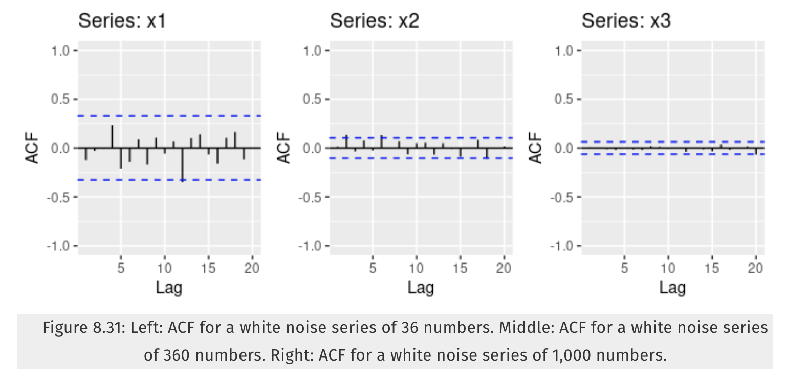

```{r setup, include=FALSE}
knitr::opts_chunk$set(echo = TRUE)
library(ggplot2)
library(gridExtra)
library(dplyr)
library(fpp)
```

## Exercise 8.1
Figure 8.31 shows the ACFs for 36 random numbers, 360 random numbers and 1,000 random numbers.

**a** Explain the differences among these figures. Do they all indicate that the data are white noise?

These 3 images show data that is white noise since the ACF values all lie within the blue dotted lines and are close to zero.  As the number of samples increases the lines of significance or blue lines get smaller.  This is because if the data is white noise we expect the data to fall within $\frac{+/-2}{\sqrt{T})}$ of 0, where T is the number of data samples.    
  
**b** Why are the critical values at different distances from the mean of zero? Why are the autocorrelations different in each figure when they each refer to white noise?

The critical values are different distances from the mean zero because the sample sizes are different.  The critical values are calculated by $\frac{+/-2}{\sqrt{T})}$ where T is the number of data samples.  T is increasing so our critical values are decreasing with each image.  In each image, the autocorrelations are different because the data is random in each image and has no autocorrelation. The points showing higher levels of autocorrelation are just due to random chance. 5% of the data may raise above the significance line and still be white noise.


## Exercise 8.2
A classic example of a non-stationary series is the daily closing IBM stock price series (data set ibmclose). Use R to plot the daily closing prices for IBM stock and the ACF and PACF. Explain how each plot shows that the series is non-stationary and should be differenced.
```{r get-data, fig.height=8}

ibmclose %>% ggtsdisplay()
```
* Looking at the daily stock prices we see an increasing trend until about day 100 then a change in direction. A downward trend continues until day 260 and changes direction again.
* The ACF plot shows an initial large autocorrelation value that gradually decreases as the lag increases, which indicates a trend.  Data with a trend is non-stationary.
* The PACF shows a single significant value for lag 1.  This means the first lag explains all of the correlation that exists in the higher lags. This implies a consistent trend. Since there are no spikes later on we can assume no seasonality.

## Exercise 8.6
Use R to simulate and plot some data from simple ARIMA models.
**a** Use the following R code to generate data from an AR(1) model with $\theta_1 = 0.6$ and $\sigma^{2} = 1$.  The process starts with $y_1 = 0$.
```{r ex-8.6-a}
y <- ts(numeric(100))
e <- rnorm(100)
for(i in 2:100)
  y[i] <- 0.6*y[i-1] + e[i]

```

**b** Produce a time plot for the series.  How does the plot change as you change $\phi_1$?
```{r additional-plots, fig.height=8}
get_data <- function(phi){
  y <- ts(numeric(100))
  e <- rnorm(100)
  for(i in 2:100){
    y[i] <- phi*y[i-1] + e[i]
  }
  return(y)
}

#Phi -0.6
plot1_data <- get_data(-0.6)
plot1_mean <- mean(plot1_data)
plot1 <- autoplot(plot1_data) + geom_line(aes(y=plot1_mean,color = 'red')) + ggtitle("Phi -0.6")

#Phi -0.2
plot2_data <- get_data(-0.2)
plot2_mean <- mean(plot2_data)
plot2 <- autoplot(plot2_data) + geom_line(aes(y=plot2_mean,color = 'red')) + ggtitle("Phi -0.2")

#Phi 0.0
plot3_data <- get_data(0.0)
plot3_mean <- mean(plot3_data)
plot3 <- autoplot(plot3_data) + geom_line(aes(y=plot3_mean,color = 'red')) + ggtitle("Phi 0.0")

#Phi 0.4
plot4_data <- get_data(0.4)
plot4_mean <- mean(plot4_data)
plot4 <- autoplot(plot4_data) + geom_line(aes(y=plot4_mean,color = 'red')) + ggtitle("Phi 0.4")

#Phi 0.6
plot5_data <- get_data(0.6)
plot5_mean <- mean(plot5_data)
plot5 <- autoplot(plot5_data) + geom_line(aes(y=plot5_mean,color = 'red')) + ggtitle("Phi 0.6")

#Phi 0.8
plot6_data <- get_data(0.8)
plot6_mean <- mean(plot6_data)
plot6 <- autoplot(plot6_data) + geom_line(aes(y=plot6_mean,color = 'red')) + ggtitle("Phi 0.8")

#Phi 0.99
plot7_data <- get_data(0.99)
plot7_mean <- mean(plot7_data)
plot7 <- autoplot(plot7_data) + geom_line(aes(y=plot7_mean,color = 'red')) + ggtitle("Phi 0.99")

grid.arrange(plot1, plot2,plot3,plot4,plot5,plot6,plot7,nrow = 7)

```
We can see that when $\phi < 0$ then $y_{t}$ oscillates around the mean, which is the red line. As $\phi$ increases, the graphs get smoother with less drastic changes as $y_{t} increases$.


**c** Write your own code to generate data from an MA(1) model with $\theta_1 = 0.6$ and $\sigma^{2} = 1$.
```{r 8.6-c}
get_MA_data <- function(theta){
  y <- ts(numeric(100))
  e <- rnorm(100)
  for(i in 2:100){
    y[i] <- theta*e[i-1] + e[i]
  }
  return(y)
}

get_MA_data(0.6)
```

**d** Produce a time plot for the series.  How does the plot change as your change $\theta_1$?
```{r 8.6-d, fig.height=10}
plot1 <- autoplot(get_MA_data(-0.8)) + ggtitle("Theta -0.8")
plot2 <- autoplot(get_MA_data(-0.4)) + ggtitle("Theta -0.4")
plot3 <- autoplot(get_MA_data(-0.2)) + ggtitle("Theta -0.2")
plot4 <- autoplot(get_MA_data(0.0)) + ggtitle("Theta 0.0")
plot5 <- autoplot(get_MA_data(0.2)) + ggtitle("Theta 0.2")
plot6 <- autoplot(get_MA_data(0.4)) + ggtitle("Theta 0.4")
plot7 <- autoplot(get_MA_data(0.8)) + ggtitle("Theta 0.8")
plot8 <- autoplot(get_MA_data(0.9)) + ggtitle("Theta 0.9")
grid.arrange(plot1, plot2,plot3,plot4,plot5,plot6,plot7,plot8,nrow = 8)
```
As $theta$ increases the graphs become smoother.  When $\theta$ is larger, the values for $y_{t}$ are less drastic from one to the next.  

**e** Generate data from an ARMA(1,1) model with $\phi_1$ = 0.6, $\theta_1 = 0.6$ and $\sigma^{2} = 1$.

The ARMA(1,1) model is a combination of AR(1) and MA(1).  This represents the following function:

$y(t) = \sigma + \phi_1*y_{t-1} + \theta_1*\epsilon_{t-1} + \epsilon$
```{r 8.6-e}
get_ARMA_data <- function(theta,phi){
  y <- ts(numeric(100))
  e <- rnorm(100)
  for(i in 2:100){
    #Represents:    AR(1)        MA(1)
    y[i] <- phi*y[i-1] + theta*e[i-1] + e[i]
  }
  return(y)
}

get_ARMA_data(0.6,0.6)
```
**f** Generate data from an AR(2) model with $\phi_1 = -0.8, \phi_2 = 0.3, \sigma^{2} = 1$  . (Note that these parameters will give a non-stationary series.)
```{r 8.6-f}
get_AR2_data <- function(phi1,phi2){
  y <- ts(numeric(100))
  e <- rnorm(100)
  for(i in 3:100){
    y[i] <- phi1*y[i-1] + phi2*y[i-2] + e[i]
  }
  return(y)
}
get_AR2_data(-0.8,0.3)
```
**g** Graph the latter two series and compare them.
```{r 8.6-g-plot1}

plot1 <- ggtsdisplay(get_ARMA_data(0.6,0.6), main = "ARMA(1,1) with Phi1 = 0.6 and Theta1 = 0.6")
plot1

```
```{r 8.6-g-plot2}

plot2 <- ggtsdisplay(get_AR2_data(-0.8,0.3), main = "AR(2) with Phi1 = -0.8 and Phi2 = 0.3")
plot2

```
  
**ARMA(1,1)** looks like stationary data while **AR(2)** swings back and forth across 0 with an increasing rate.  AR(2) has an increasing trend.  AR(2) is non-stationary since it has a trend.  

## Exercise 8.8
Consider *austa*, the total international visitors to Australia (in millions) for the period 1980-2015.
```{r 8.8}
head(austa)
```
**a** Use *auto.arima()* to find an appropriate ARIMA model. What model was selected. Check that the residuals look like white noise. Plot forecasts for the next 10 periods.
```{r 8.8-a}
fit <- auto.arima(austa)
fit
```
The ARIMA(0,1,0) model with drift was selected. Now let's plot the residuals.  
  
```{r 8.8-a-residuals}
plot(fit$residuals)
```

The residuals do look like white noise.  Now let's plot the next 10 forecasts.  
  
```{r 8.8-a-10-forecasts}
autoplot(forecast(fit,h=10)) + ggtitle("ARIMA(0,1,0) model with drift - Forecast Next 10 Years") + xlab("Time") + ylab("austa")
```


**b** Plot forecasts from an ARIMA(0,1,1) model with no drift and compare these to part a. Remove the MA term and plot again.
```{r 8.8-b-ARIMA(0,1,1)-no-drift}
arima_011_no_drift <- forecast(Arima(austa,order=c(0,1,1),include.drift=FALSE),h=10)
autoplot(arima_011_no_drift) + ggtitle("Arima(0,1,1) - no drift")
```
```{r 8.8-b-ARIMA(0,1,0)-no-drift}
arima_010_no_drift <- forecast(Arima(austa,order=c(0,1,0),include.drift=FALSE),h=10)
autoplot(arima_010_no_drift) + ggtitle("Arima(0,1,0) - no drift")
```
The forecast for ARIMA(0,1,0) with drift is higher and increases while ARIMA(0,1,1) without drift and ARIMA(0,1,0) without drift look very similar.

**c** Plot forecasts from an ARIMA(2,1,3) model with drift. Remove the constant and see what happens.
```{r 8.8-c}
arima_213_drift <- forecast(Arima(austa,order=c(2,1,3),include.drift=TRUE),h=10)
arima_213_drift_no_constant <- forecast(Arima(austa,order=c(2,1,3),include.drift=TRUE,include.constant=FALSE),h=10)
autoplot(arima_213_drift) + ggtitle("Arima(2,1,3) - with drift")
autoplot(arima_213_drift_no_constant) + ggtitle("Arima(2,1,3) - with drift & no constant")
```
When we remove the constant the interval of prediction widens.

**d** Plot forecasts from an ARIMA(0,0,1) model with a constant. Remove the MA term and plot again.
```{r 8.8-d}
arima_001_constant <- forecast(Arima(austa,order=c(0,0,1),include.constant=TRUE),h=10)
autoplot(arima_001_constant) + ggtitle("Arima(0,0,1) - with constant")

```

```{r 8.8-d-no-MA}
arima_000_constant <- forecast(Arima(austa,order=c(0,0,0),include.constant=TRUE),h=10)
autoplot(arima_000_constant) + ggtitle("Arima(0,0,0) - with constant")

```

**e** Plot forecasts from an ARIMA(0,2,1) model with no constant.
```{r 8.8-e}
arima_021_no_constant <- forecast(Arima(austa,order=c(0,2,1),include.constant=FALSE),h=10)
autoplot(arima_021_no_constant) + ggtitle("Arima(0,2,1) - no constant")

```
